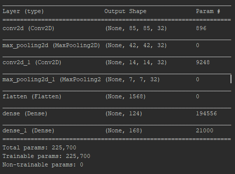

# Convolutional Neural Network
   Developed neural network is supposed to distinguish between
classes and their spectrograms of bearings given in the dataset.  
Dataset is the set of data, which contains 168 classes. Each of
those classes represents a certain condition of bearing (Forces and revolutions).  
Layers of the multivariate convolutional neural network:  
 

Using either the following table (description_of_data.xlsx) or dataframe.py file
user can easily get the condition of a bearing.  
 
  
 
<pre>
1. class № 3 = Forces (Axial = 0N, Radial = 0N) Revolutions = 300rpm
2. class № 111 = Forces (Axial = 100N, Radial = 0N) Revolutions = 100rpm
3. class № 157 = Forces (Axial = 500N, Radial = 700N) Revolutions = 700rpm
 
</pre>
 
Block scheme of algorithm  
 

# Get started
use pip to install requirements for this project. Don't forget to upgrade pip
<pre>
$pip install --upgrade pip
$ pip install -r requirements.txt
</pre>
#Usage step 1
To train the CNN model use CNN.py file, remove commentaries in the following lines: 
<pre>
classifier.fit_generator( 
                 training_set, 
                 steps_per_epoch=40,  
                 epochs=100, 
                 validation_data=test_set, 
                 validation_steps=10  
 ) 
 classifier.save('saved_models')
 </pre>
 # Usage step 2
 If the neural network is installed at the first time, there is no need to train
 model, due to the existing model in the saved_models directory.  
 To make a new prediction on the model, which already exists, run main.py  
 Write in terminal:
 <pre>
 python 3 main.py
 </pre>
 # Usage step 3
   To make a prediction on your own dataset open up single_prediction.py function and put
    a path to your file to make a prediction
 # Overview
 This neural network model has shown 89,5% accuracy on the validation data and 99,2% on training 
 data. Confusion matrix of validation data performance was built:
   
 
 
